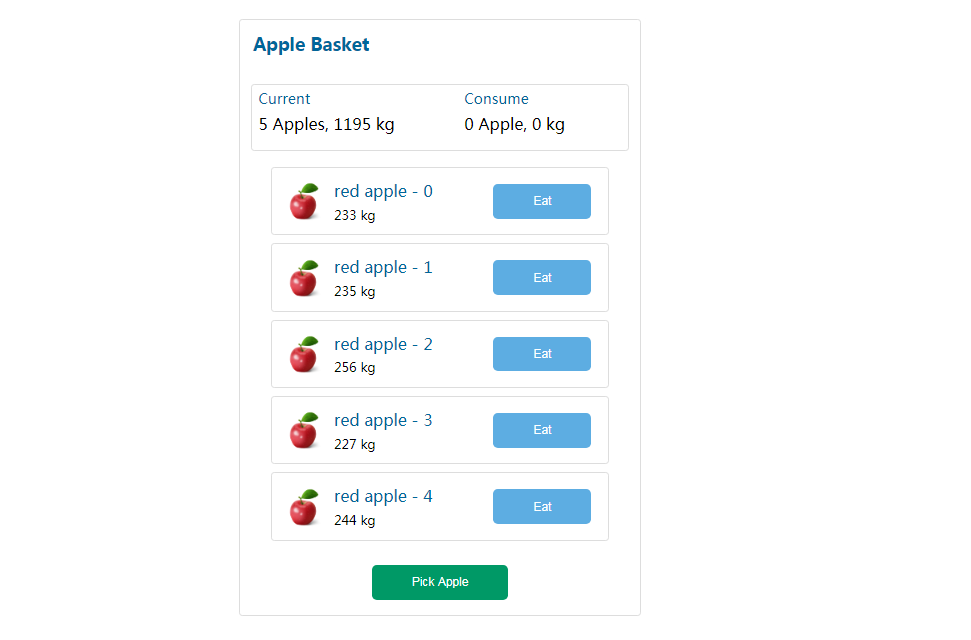

<p align="center">
    <h3 align="center">Simple Apple Basket Single Page<br></h3>
</p>


### What were using

* React 16
* Webpack 3
* ImmutableJS
* Redux
* Babel
* ES6
* CSS3
* HTML5

### Features


* Simple implementation of picking apples into the basket.
* The apple will be listed as weight and type.
* Total weight of picking will be calculate automatically and the weight will be deducted if apple is eaten.
* Total weight of consuming will be calculated when apple has been eaten.


### To run

* Clone the project:

* Install the dependencies by:

```
npm install
```

* Run development server by:

```
npm run server
```

Open the web browser to `http://localhost:8085/`

